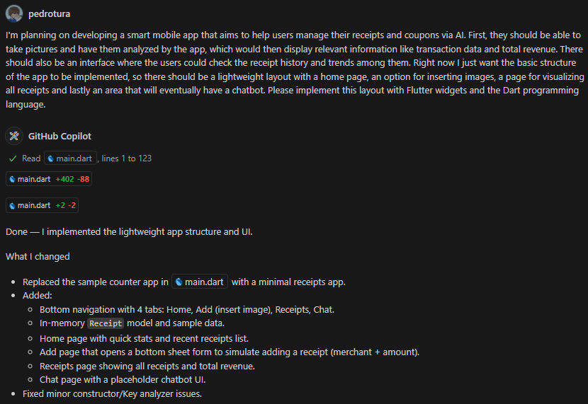
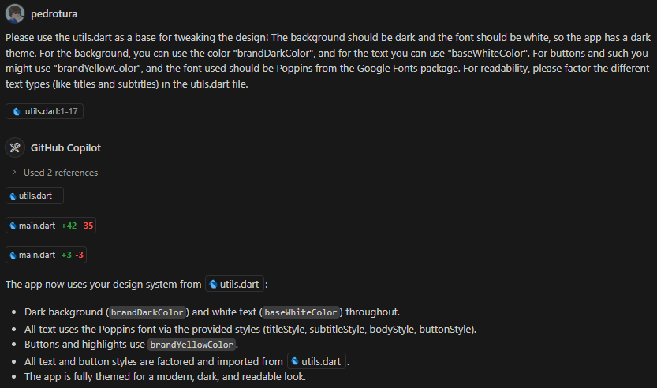
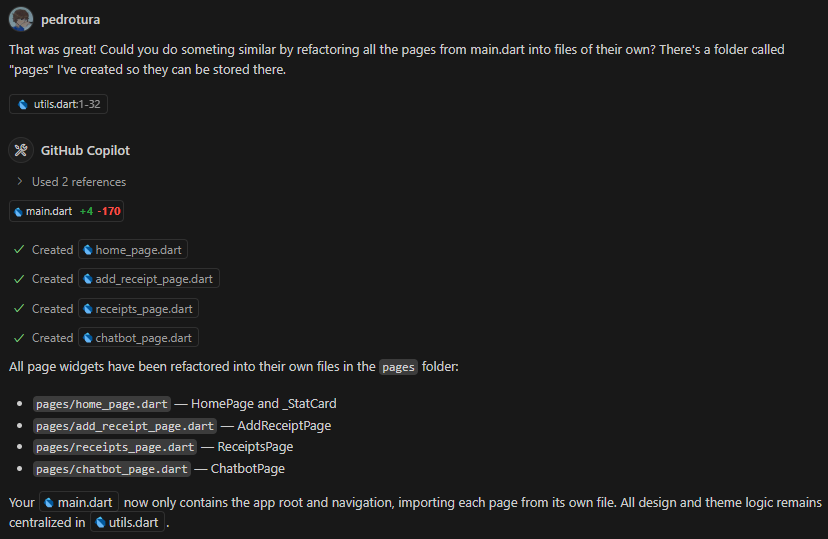

# Checkpoint 06 - ReceiptApp

Aplicativo inteligente desenvolvido com Flutter para analisar notas fiscais e gerar insights financeiros.

## Integrantes

Alexandre Biancolini dos Santos - RM93769
Daniel Henrique Domeneguetti Oliveira - RM95081
Gabriel Vidoi Mendonça - RM94226
Pedro Henrique Gonçalves Tura - RM93391
Rafael Gualdieri Pinheiro - RM93036

## Etapas de desenvolvimento

### Commit 2 - Construindo layout básico do app

Prompts utilizados:

